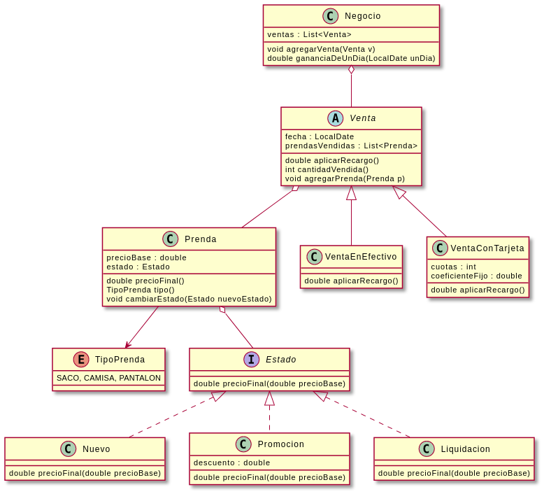

# Macowins

## Consigna

La consiga del ejercicio se
encuentra [aquí](https://docs.google.com/document/d/1mjWKl9YH9Bb39iIUl1bQj_xhx_-CjCAMpcAXRqKhVjU/edit)

-----

Se requiere:

* Identificar los requerimientos
* Presentar una solución usando el paradigma de objetos (pseudocódigo, diagrama de clases).
* Explicar todo lo que considere necesario en prosa.
* Si se descarta alguna alternativa durante el desarrollo de la solución, o si se tiene otra solución, explicarla
  brevemente.

---
La conocida empresa de ropa formal para caballeros, Macowins, es capaz de darle soporte a la venta de prendas. Un
fragmento de la grabación del analista con el cliente:

“Queremos saber el precio de venta de una prenda y sus tipos, los tipos de prenda son: sacos, pantalones, camisas.”

El cálculo del precio de una prenda es, el precio propio de la prenda modificado según el estado de la prenda, que
pueden ser:

* Nueva: en este caso no modifican el precio base.
* Promoción: Le resta un valor fijo decidido por el usuario.
* Liquidación: Es un 50% del valor del producto.

Ah, un requerimiento más: Macowins registra las ventas de estas prendas y necesita saber las ganancias de un determinado
día.

“Cada venta tiene asociada las prendas que se vendieron, su cantidad y la fecha de venta. Las ventas pueden ser en
efectivo o con tarjeta. En el caso que sea con tarjeta, tienen el mismo comportamiento que en efectivo (el cual no
modifica el precio), sólo que se le aplica un recargo según la cantidad de cuotas seleccionadas
(cantidad de cuotas * un coeficiente fijo + 0.01 del valor de cada prenda).”

---

# Resolucion

## Código

El código utilizado se puede encontrar [aquí](src/main/java/domain/ropa/)

## Requirimientos

- Saber tipo y precio de una prenda.
- El precio debe ser determinado por un precio "base" modificado por el estado, que puede ser:
    * Nueva (no modifica el precio)
    * Promoción (resta valor predefinido)
    * Liquidación (50% menos).
- Registrar ventas y ganancias de un determinado día.
- Las ventas se registran con: prendas que se vendieron, cantidad y fecha.
- Las ventas pueden ser en efectivo o con tarjeta. Si es con tarjeta, hay un recargo:
    * cantidad de cuotas * un coeficiente fijo + 0.01 del valor de cada prenda

## Diagrama de Clases



El códico utilizado para el diagrama UML se puede encontrar [aquí](DiagramaDeObjetos.puml)

* Java 8. :warning: Si bien el proyecto no lo limita explícitamente, el comando `mvn verify` no funcionará con versiones
  mas modernas de Java.
* JUnit 5. :warning: La versión 5 de JUnit es la más nueva del framework y presenta algunas diferencias respecto a la
  versión "clásica" (JUnit 4). Para mayores detalles, ver:
    * [Apunte de herramientas](https://docs.google.com/document/d/1VYBey56M0UU6C0689hAClAvF9ILE6E7nKIuOqrRJnWQ/edit#heading=h.dnwhvummp994)
    * [Entrada de Blog (en inglés)](https://www.baeldung.com/junit-5-migration)
    * [Entrada de Blog (en español)](https://www.paradigmadigital.com/dev/nos-espera-junit-5/)
* Maven 3.3 o superior

# ¿Cómo resolver el TP?

1. Leé el enunciado atentamente
2. Tratá de resolverlo en orden
3. Mientras vas implementando el código que resuelve el problema, codificá casos de prueba que validen la solución. Ya
   te dejamos algunos para que completes y te sirvan como punto de partida, pero no son suficientes y deberás agregar
   los tuyos.

# ¿Cómo configurar el IDE?

1. Tabular con dos espacios
2. Instalar y configurar Checkstyle
3. Usar fin de linea unix

# ¿Cómo ejecutar los tests?

```
mvn test
```

# ¿Cómo validar el proyecto?

```
mvn verify
```

Este comando hará lo siguiente:

1. Ejecutará los tests
2. Validará las convenciones de formato mediante checkstyle
3. Detectará la presencia de (ciertos) code smells
4. Validará la cobertura del proyecto

# Entrega del proyecto

Para entregar el proyecto, crear un tag llamado `entrega-final`. Es importante que antes de realizarlo se corra la
validación
explicada en el punto anterior. Se recomienda hacerlo de la siguiente forma:

```
mvn clean verify && git tag entrega-final && git push origin HEAD --tags
```
